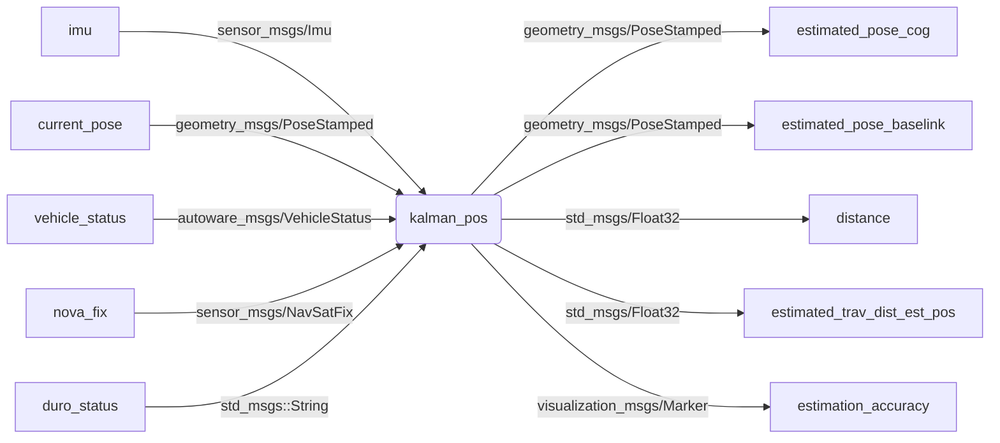

# `kalman_pos` ROS package 

Kálmán filter based ROS node (`geometry_msgs/PoseStamped`, `sensor_msgs/Imu`, `autoware_msgs/VehicleStatus`)
- [`geometry_msgs/PoseStamped`](http://docs.ros.org/en/melodic/api/geometry_msgs/html/msg/PoseStamped.html)
- [`sensor_msgs/Imu`](http://docs.ros.org/en/melodic/api/sensor_msgs/html/msg/Imu.html)
- `autoware_msgs/VehicleStatus` - *Warning*: Autoware sometimes [changes](https://gitlab.com/autowarefoundation/autoware.ai/messages/-/merge_requests/16/diffs?commit_id=234ad070a92063b64ea8df792b46b59fefd5fe1f) the messages.

## Build

```
cd ~/catkin_ws/src/
git clone https://github.com/jkk-research/kalman_pos
catkin build kalman_pos
source ~/.bashrc
```
(it is assumed that `.bashrc` contains `source ~/catkin_ws/devel/setup.bash`)

# ROS publications / subscriptions



## Run

```
rosrun kalman_pos kalman_pos_node _pose_topic:=current_pose
```

```
roslaunch kalman_pos kalman_pos01.launch
```

### Parameters
- pose_topic
  - type: string
  - default value: gps/duro/current_pose
  - description: the name of the GNSS position topic (subscriber, geometry_msgs::PoseStamped)
- vehicle_status_topic
  - type: string 
  - default value: vehicle_status
  - description: the name of the vehicle status topic (subscriber, autoware_msgs::VehicleStatus)
- nav_sat_fix_topic
  - type: string 
  - default value: gps/nova/fix
  - description: the name of the Novatel NavSatFix topic (relevant only for Novatel GNSS) (subscriber, sensor_msgs::NavSatFix)
- duro_status_string_topic 
  - type: string 
  - default value: gps/duro/status_string
  - description: the name of the Duro status topic (relevant only for Duro GNSS) (subscriber, std_msgs::String)
- inspvax_topic 
  - type: string 
  - default value: gps/nova/inspvax
  - description: the name of the Novatel Inspvax topic (relevant only for Novatel GNSS) (subscriber, novatel_gps_msgs::Inspvax)
- imu_topic 
  - type: string 
  - default value: imu/data
  - description: the name of the IMU data topic (subscriber, sensor_msgs::Imu)
- est_cog_topic 
  - type: string 
  - default value: estimated_pose_cog
  - description: the name of the estimated position topic (transformed into the CoG) (Publisher, geometry_msgs::PoseStamped)
- est_trav_distance_odom_topic 
  - type: string 
  - default value: distance
  - description: the name of the estimated traveled distance position topic (calculation is based on the odemetry) (Publisher, std_msgs::Float32)
- est_trav_distance_est_pos_topic 
  - type: string 
  - default value: estimated_trav_dist_est_pos
  - description: the name of the estimated traveled distance position topic (calculation is based on the estimated position) (Publisher, std_msgs::Float32)
- est_baselink_topic 
  - type: string 
  - default value: estimated_pose_baselink
  - description: the name of the estimated position topic (transformed into the baselink) (Publisher, geometry_msgs::PoseStamped)
- est_accuracy_topic 
  - type: string 
  - default value: estimation_accuracy
  - description: the name of the estimattion accuracy marker topic (Publisher, visualization_msgs::Marker)
- lROSLoopRate_cl_hz 
  - type: int 
  - default value: 60
  - description: the ROS loop rate of the node (in Hz) 
- estimation_method 
  - type: int 
  - default value: 8
  - description: the estimation method, only works if the gnss_source is "none"
    - 0: Kinematic model with EKF and without GNSS position; initial GNSS based orientation estimation disabled
    - 1: Kinematic + dynamic model without EKF and GNSS position; initial GNSS based orientation estimation disabled
    - 2: Kinematic model without EKF and GNSS position; initial GNSS based orientation estimation enabled
    - 3: Kinematic + dynamic model without EKF and GNSS position; initial GNSS based orientation estimation enabled
    - 4: Currently not used
    - 5: Kinematic model with EKF and without GNSS; initial GNSS based orientation estimation disabled
    - 6: Kinematic + dynamic model with EKF and without GNSS position; initial GNSS based orientation estimation disabled (USE THIS AS DEFAULT FOR ESTIMATION WITHOUT GNSS)
    - 7: Kinematic model with EKF and without GNSS position; initial GNSS based orientation estimation enabled
    - 8: Kinematic + dynamic model with EKF and without GNSS position; initial GNSS based orientation estimation enabled 
    - 9: Currently used for debugging
    - 10: Used only when the vehicle_type is "SZEmission" and GNSS is based on Duro. Automatically switch between the different estimation methods
- gnss_source 
  - type: string 
  - default value: none
  - description: The type of the GNSS system. Use "none" for the most of the cases. The "duro" and "nova" are valid values but use only for debugging.  
- vehicle_type 
  - type: string 
  - default value: SZEmission
  - description: the vehicle type, the vehicle parameters are calculated based on this setting. Valid values: "SZEmission", "leaf"
- dynamic_time_calc 
  - type: bool 
  - default value: true
  - description: true if the time difference is calculated between each step, false if fix value is used (1/lROSLoopRate_cl_hz)
- kinematic_model_max_speed 
  - type: double 
  - default value: 0.3
  - description: the speed where the algorithm switch to the dynamic model from the kinematic model
- do_not_wait_for_gnss_msgs 
  - type: bool 
  - default value: true
  - description: true if the algrithm in not waiting for the first positon message (use this for the algorithms without GNSS position and orientation estimation)
- vehicle_param_c1
  - type: double 
  - default value: 3000
  - description: front wheel cornering stiffness (for single track model) [N/rad]
- vehicle_param_c2
  - type: double 
  - default value: 3000
  - description: rear wheel cornering stiffness (for single track model) [N/rad]
- vehicle_param_m
  - type: double 
  - default value: 180
  - description: mass of the vehicle [kg]
- vehicle_param_jz
  - type: double 
  - default value: 270
  - description: moment of inertia (z axle) [kg*m2]
- vehicle_param_l1
  - type: double 
  - default value: 0.324
  - description: CoG distance from the front axle [m]
- vehicle_param_l1
  - type: double 
  - default value: 0.976
  - description: CoG distance from the rear axle [m]
- vehicle_param_swr
  - type: double 
  - default value: 1
  - description: Steering wheel ratio

## Rosbag

Download: [jkk-research.github.io/#dataset](https://jkk-research.github.io/#dataset)

```
rosbag play -l leaf-2022-03-26-zala-smart-city.bag
```


