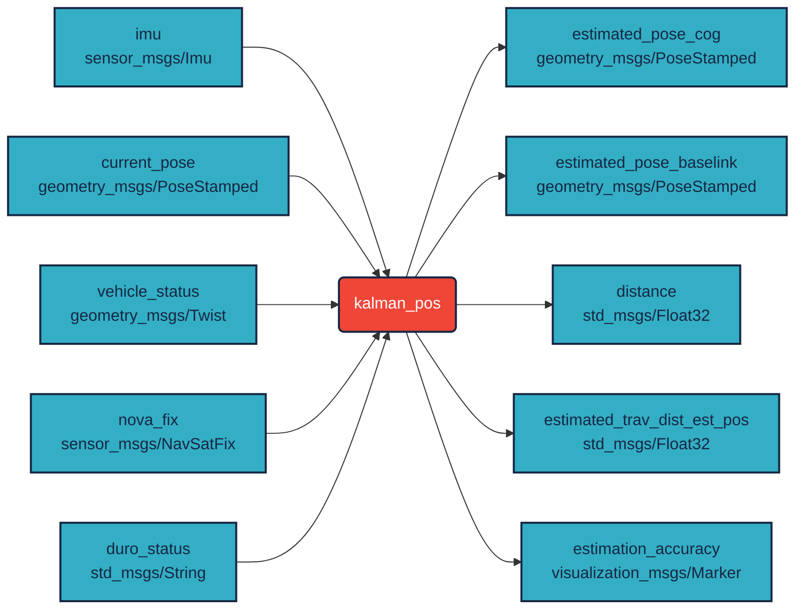

# `kalman_pos` `ROS 2` package

Kálmán filter based `ROS 2` node (`geometry_msgs/PoseStamped`, `sensor_msgs/Imu`)

[](https://docs.ros.org/en/humble/)

- [`geometry_msgs/PoseStamped`](http://docs.ros.org/en/melodic/api/geometry_msgs/html/msg/PoseStamped.html)
- [`sensor_msgs/Imu`](http://docs.ros.org/en/melodic/api/sensor_msgs/html/msg/Imu.html)

## Build

``` bash
cd ~/ros2_ws/src 
```

``` bash
git clone https://github.com/jkk-research/kalman_pos
```

``` bash
cd ~/ros2_ws
```

``` bash
colcon build --symlink-install --packages-select kalman_pos
```

# ROS publications / subscriptions



## Run

<details>
<summary> Don't forget to source before ROS commands.</summary>

``` bash
source ~/ros2_ws/install/setup.bash
```
</details>

``` bash
ros2 launch kalman_pos kalman_pos_node.launch.py
```

### Parameters
- `pose_topic`
  - type: `string`
  - default value: `gps/duro/current_pose`
  - description: the name of the GNSS position topic (subscriber, geometry_msgs::PoseStamped)
- `vehicle_status_topic`
  - type: `string` 
  - default value: `vehicle_status`
  - description: the name of the vehicle status topic (subscriber, autoware_msgs::VehicleStatus)
- `nav_sat_fix_topic`
  - type: `string` 
  - default value: `gps/nova/fix`
  - description: the name of the Novatel NavSatFix topic (relevant only for Novatel GNSS) (subscriber, sensor_msgs::NavSatFix)
- `imu_topic` 
  - type: `string` 
  - default value: `imu/data`
  - description: the name of the IMU data topic (subscriber, `sensor_msgs::Imu`)
- `est_cog_topic` 
  - type: `string` 
  - default value: `estimated_pose_cog`
  - description: the name of the estimated position topic (transformed into the CoG) (Publisher, `geometry_msgs::PoseStamped`)
- `est_trav_distance_odom_topic` 
  - type: `string` 
  - default value: `distance`
  - description: the name of the estimated traveled distance position topic (calculation is based on the odemetry) (`Publisher, std_msgs::Float32`)
- `est_trav_distance_est_pos_topic` 
  - type: `string` 
  - default value: `estimated_trav_dist_est_pos`
  - description: the name of the estimated traveled distance position topic (calculation is based on the estimated position) (Publisher, `std_msgs::Float32`)
- `est_baselink_topic` 
  - type: `string` 
  - default value: estimated_pose_baselink
  - description: the name of the estimated position topic (transformed into the baselink) (Publisher, geometry_msgs::PoseStamped)
- `est_accuracy_topic` 
  - type: `string` 
  - default value: estimation_accuracy
  - description: the name of the estimattion accuracy marker topic (Publisher, visualization_msgs::Marker)
- `loop_rate_hz` 
  - type: `int` 
  - default value: `60`
  - description: the ROS loop rate of the node (in Hz) 
- `estimation_method` 
  - type: `int` 
  - default value: `8`
  - description: the estimation method
    - `0`: Kinematic model with EKF and without GNSS position; initial GNSS based orientation estimation disabled
    - `1`: Kinematic + dynamic model without EKF and GNSS position; initial GNSS based orientation estimation disabled
    - `2`: Kinematic model without EKF and GNSS position; initial GNSS based orientation estimation enabled
    - `3`: Kinematic + dynamic model without EKF and GNSS position; initial GNSS based orientation estimation enabled
    - `4`: Currently not used
    - `5`: Kinematic model with EKF and without GNSS; initial GNSS based orientation estimation disabled
    - `6`: Kinematic + dynamic model with EKF and without GNSS position; initial GNSS based orientation estimation disabled (USE THIS AS **DEFAULT** FOR ESTIMATION **WITHOUT GNSS**)
    - `7`: Kinematic model with EKF and without GNSS position; initial GNSS based orientation estimation enabled
    - `8`: Kinematic + dynamic model with EKF and without GNSS position; initial GNSS based orientation estimation enabled 
    - `9`: Currently used for debugging
    - `10`: Automatically switch between the different estimation methods
- `dynamic_time_calc` 
  - type: `bool` 
  - default value: `true`
  - description: true if the time difference is calculated between each step, false if fix value is used (1/lROSLoopRate_cl_hz)
- `kinematic_model_max_speed` 
  - type: `double` 
  - default value: `0.3`
  - description: the speed where the algorithm switch to the dynamic model from the kinematic model
- `do_not_wait_for_gnss_msgs` 
  - type: `bool` 
  - default value: `true`
  - description: `true` if the algrithm in not waiting for the first positon message (use this for the algorithms without GNSS position and orientation estimation)
- `msg_timeout`
  - type: `double` 
  - default value: `2000`
  - description: timeout for vehicle status and IMU message, if these messages does not arrive until timeout then the estimation will stop [ms]
- `vehicle_param_c1`
  - type: `double` 
  - default value: `3000`
  - description: front wheel cornering stiffness (for single track model) [N/rad]
- `vehicle_param_c2`
  - type: `double` 
  - default value: `3000`
  - description: rear wheel cornering stiffness (for single track model) [N/rad]
- `vehicle_param_m`
  - type: `double` 
  - default value: `180`
  - description: mass of the vehicle [kg]
- `vehicle_param_jz`
  - type: `double` 
  - default value: `270`
  - description: moment of inertia (z axle) [kg*m2]
- `vehicle_param_l1`
  - type: `double` 
  - default value: `0.324`
  - description: CoG distance from the front axle [m]
- `vehicle_param_l1`
  - type: `double` 
  - default value: `0.976`
  - description: CoG distance from the rear axle [m]
- `vehicle_param_swr`
  - type: `double` 
  - default value: `1.0`
  - description: Steering wheel ratio

## Rosbag

Download: [jkk-research.github.io/dataset](https://jkk-research.github.io/dataset)

Direct download of zipped MCAPs: [download zip (~15 MB)](https://laesze-my.sharepoint.com/:u:/g/personal/herno_o365_sze_hu/EVofDCG_ORZJh--XTVLFsFEBOUYB1eAbHAzdTVDdf19Y9g?download=1)

Make sure you have `unzip` (`sudo apt-get install unzip`) and:

``` powershell
unzip jkkds02.zip
```

``` powershell  
ros2 bag play nissan_zala_50_zeg_1_0.mcap
```

# Cite & paper

If you use any of this code please consider citing the [paper](https://journals.sagepub.com/eprint/MJGI8JXN8KAWBGZU6D24/full):

```bibtex
@Article{doi:10.1177/09544070241266281,
    title = {Localization robustness improvement for an autonomous race car using multiple extended Kalman filters},
    author = {Krisztián Enisz and István Szalay and Ernő Horváth},
    journal = {Proceedings of the Institution of Mechanical Engineers, Part D: Journal of Automobile Engineering},
    volume = {0},
    url = {https://doi.org/10.1177/09544070241266281},
    eprint = {https://doi.org/10.1177/09544070241266281},
    doi = {10.1177/09544070241266281}
}
```
