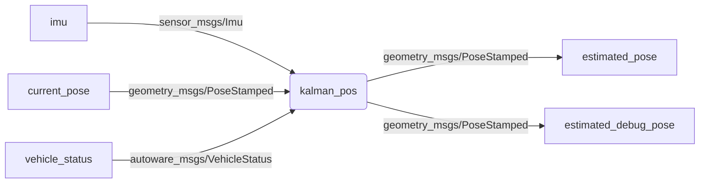

# `kalman_pos` ROS package 

Kálmán filter based ROS node (`geometry_msgs/PoseStamped`, `sensor_msgs/Imu`, `autoware_msgs/VehicleStatus`)
- [`geometry_msgs/PoseStamped`](http://docs.ros.org/en/melodic/api/geometry_msgs/html/msg/PoseStamped.html)
- [`sensor_msgs/Imu`](http://docs.ros.org/en/melodic/api/sensor_msgs/html/msg/Imu.html)
- `autoware_msgs/VehicleStatus` - *Warning*: Autoware sometimes [changes](https://gitlab.com/autowarefoundation/autoware.ai/messages/-/merge_requests/16/diffs?commit_id=234ad070a92063b64ea8df792b46b59fefd5fe1f) the messages.

## Build

```
cd ~/catkin_ws/src/
git clone https://github.com/jkk-research/kalman_pos
catkin build kalman_pos
source ~/.bashrc
```
(it is assumed that `.bashrc` contains `source ~/catkin_ws/devel/setup.bash`)

# ROS publications / subscriptions



## Run

```
rosrun kalman_pos kalman_pos_node _pose_topic:=current_pose
```

```
roslaunch kalman_pos kalman_pos01.launch
```

No autoware version:
```
rosrun kalman_pos kalman_pos_no_aw _pose_topic:=gps/duro/current_pose _debug:=true
```


## Rosbag

Download: [jkk-research.github.io/#dataset](https://jkk-research.github.io/#dataset)

```
rosbag play -l leaf-2022-03-26-zala-smart-city.bag
```


