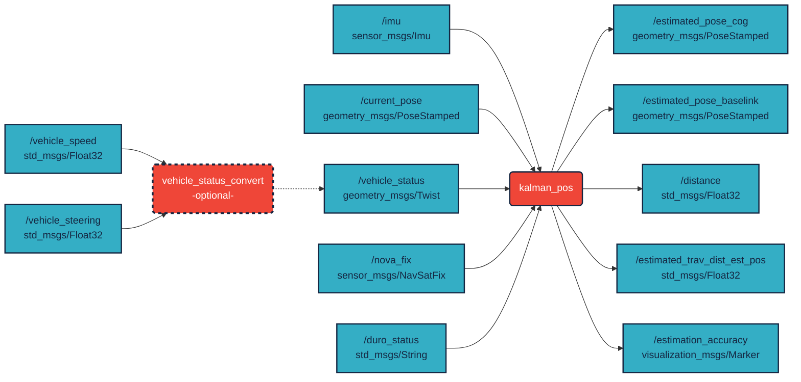

# `kalman_pos` `ROS 2` package

Kálmán filter based `ROS 2` node (`geometry_msgs/PoseStamped`, `sensor_msgs/Imu`)

[](https://docs.ros.org/en/humble/)

- [`geometry_msgs/PoseStamped`](http://docs.ros.org/en/melodic/api/geometry_msgs/html/msg/PoseStamped.html)
- [`sensor_msgs/Imu`](http://docs.ros.org/en/melodic/api/sensor_msgs/html/msg/Imu.html)

## Build

IMU transformer is a dependency, it might be needed if the IMU is not in the center of gravity (COG)

```
sudo apt install ros-$ROS_DISTRO-imu-transformer
```

``` bash
cd ~/ros2_ws/src 
```
> [!CAUTION]
> If you want the full compatiblity with our [paper](https://journals.sagepub.com/eprint/MJGI8JXN8KAWBGZU6D24/full), please use [release](https://github.com/jkk-research/kalman_pos/releases) version `0.3.0`. Newer releases use modified paramters. Either clone this version:
> ```
> git clone https://github.com/jkk-research/kalman_pos --branch v.0.3.0
> ```

Or clone the latest version:
``` bash
git clone https://github.com/jkk-research/kalman_pos
```

``` bash
cd ~/ros2_ws
```

``` bash
colcon build --symlink-install --packages-select kalman_pos
```

# ROS publications / subscriptions

The main node is `kalman_pos_node`, also there is a `vehicle_status_convert` node for converting the vehicle status message to the required format.


```mermaid
flowchart LR

A[ /imu<br/>sensor_msgs/Imu] --> F(kalman_pos)
B[ /current_pose<br/>geometry_msgs/PoseStamped] --> F
C[ /vehicle_status<br/>geometry_msgs/Twist] --> F
D[ /nova_fix<br/>sensor_msgs/NavSatFix] --> F
E[ /duro_status<br/>std_msgs/String] --> F
F -->  G[ /estimated_pose_cog<br/>geometry_msgs/PoseStamped]
F -->  H[ /estimated_pose_baselink<br/>geometry_msgs/PoseStamped]
F -->  I[ /distance<br/>std_msgs/Float32]
F -->  J[ /estimated_trav_dist_est_pos<br/>std_msgs/Float32]
F -->  K[ /estimation_accuracy<br/>visualization_msgs/Marker]

V1(vehicle_status_convert <br> -optional-) -.-> C
V3[ /vehicle_speed <br/> std_msgs/Float32] --> V1
V4[ /vehicle_steering <br/> std_msgs/Float32] --> V1


classDef light fill:#34aec5,stroke:#152742,stroke-width:2px,color:#152742  
classDef dark fill:#152742,stroke:#34aec5,stroke-width:2px,color:#34aec5
classDef white fill:#ffffff,stroke:#152742,stroke-width:2px,color:#152742
classDef red fill:#ef4638,stroke:#152742,stroke-width:2px,color:#fff
classDef dashed fill:#ef4638,stroke:#152742,stroke-width:3px,stroke-dasharray:5,5,color:#fff

class F red
class V1 dashed
class A,B,C,D,E,G,H,I,J,K,V3,V4 light

```

## Run

<details>
<summary> Don't forget to source before ROS commands.</summary>

``` bash
source ~/ros2_ws/install/setup.bash
```
</details>

``` bash
ros2 launch kalman_pos kalman_pos_node.launch.py
```

### Parameters
- `gnss_pose_topic`
  - type: `string`
  - default value: `gps/duro/current_pose`
  - description: the name of the GNSS position topic (subscriber, geometry_msgs::PoseStamped).
- `slam_pose_topic`
  - type: `string`
  - default value: `gps/duro/current_pose`
  - description: the name of the SLAM position topic (subscriber, geometry_msgs::PoseStamped).
- `vehicle_status_topic`
  - type: `string` 
  - default value: `vehicle_status`
  - description: the name of the vehicle status topic (subscriber, geometry_msgs::msg::TwistStamped).
- `gnss_covariance_topic`
  - type: `string`
  - default value: `gps/duro/fix`
  - description: the name of the GNSS covariance topic (subscriber, sensor_msgs::msg::NavSatFix).
- `slam_covariance_topic`
  - type: `string`
  - default value: `gps/duro/fix`
  - description: the name of the SLAM covariance topic (subscriber, sensor_msgs::msg::NavSatFix)
- `imu_topic` 
  - type: `string` 
  - default value: `imu/data`
  - description: the name of the IMU data topic (subscriber, `sensor_msgs::Imu`).
- `est_cog_topic` 
  - type: `string` 
  - default value: `estimated_pose_cog`
  - description: the name of the estimated position topic (transformed into the CoG) (Publisher, `geometry_msgs::PoseStamped`).
- `est_baselink_topic` 
  - type: `string` 
  - default value: estimated_pose_baselink
  - description: the name of the estimated position topic (transformed into the baselink) (Publisher, geometry_msgs::PoseStamped).
- `est_accuracy_topic` 
  - type: `string` 
  - default value: estimation_accuracy
  - description: the name of the estimattion accuracy marker topic (Publisher, visualization_msgs::Marker).
- `est_trav_distance_odom_topic` 
  - type: `string` 
  - default value: `distance`
  - description: the name of the estimated traveled distance position topic (calculation is based on the odemetry) (`Publisher, std_msgs::Float32`).
- `est_trav_distance_est_pos_topic` 
  - type: `string` 
  - default value: `estimated_trav_dist_est_pos`
  - description: the name of the estimated traveled distance position topic (calculation is based on the estimated position) (Publisher, `std_msgs::Float32`).
- `autonomous_mode_topic`
  - type: `string`
  - default value: `myrio_state`
  - description: the name of the autonomous mode topic (subscriber, std_msgs::msg::Bool).
- `loop_rate_hz` 
  - type: `int` 
  - default value: `60`
  - description: the ROS loop rate of the node (in Hz).
- `gnss_available` 
  - type: `bool` 
  - default value: `false`
  - description: true if the GNSS position data available.
- `slam_available` 
  - type: `bool` 
  - default value: `false`
  - description: true if the SLAM position data available.
- `gnss_accuracy_limit`
  - type: `double` 
  - default value: `10.0`
  - description: if the covariance of GNSS position data is greater than this value, the GNSS position will be ignored.
- `slam_accuracy_limit`
  - type: `double` 
  - default value: `10.0`
  - description: if the covariance of SLAM position data is greater than this value, the GNSS position will be ignored.
- `gnss_default_covariance`
  - type: `double` 
  - default value: `15.0`
  - description: The default covariance value of GNSS position (used if the covariance topic is not available).
- `slam_default_covariance`
  - type: `double` 
  - default value: `15.0`
  - description: The default covariance value of SLAM position (used if the covariance topic is not available).
- `dynamic_time_calc` 
  - type: `bool` 
  - default value: `true`
  - description: true if the time difference is calculated between each step, false if fix value is used (1/lROSLoopRate_cl_hz).
- `do_not_wait_for_gnss_msgs` 
  - type: `bool` 
  - default value: `true`
  - description: `true` if the algrithm in not waiting for the first positon message (use this for the algorithms without GNSS position and orientation estimation).
- `kinematic_model_max_speed` 
  - type: `double` 
  - default value: `0.3`
  - description: the speed where the algorithm switch to the dynamic model from the kinematic model.
- `use_raw_model` 
  - type: `bool` 
  - default value: `false`
  - description: If true than the Kalman-filter is disabled and only the raw model is used for calculation.
- `orientation_est_enabled` 
  - type: `bool` 
  - default value: `false`
  - description: Enable/Disable the initial orientataion estimation (based on GNSS or SLAM data).
- `invert_yaw_rate` 
  - type: `bool` 
  - default value: `false`
  - description: If true than the yaw rate data from the IMU is inverted.
- `msg_timeout`
  - type: `double` 
  - default value: `2000`
  - description: timeout for vehicle status and IMU message, if these messages does not arrive until timeout then the estimation will stop [ms]
- `vehicle_param_c1`
  - type: `double` 
  - default value: `3000`
  - description: front wheel cornering stiffness (for single track model) [N/rad]
- `vehicle_param_c2`
  - type: `double` 
  - default value: `3000`
  - description: rear wheel cornering stiffness (for single track model) [N/rad]
- `vehicle_param_m`
  - type: `double` 
  - default value: `180`
  - description: mass of the vehicle [kg]
- `vehicle_param_jz`
  - type: `double` 
  - default value: `270`
  - description: moment of inertia (z axle) [kg*m2]
- `vehicle_param_l1`
  - type: `double` 
  - default value: `0.324`
  - description: CoG distance from the front axle [m]
- `vehicle_param_l1`
  - type: `double` 
  - default value: `0.976`
  - description: CoG distance from the rear axle [m]
- `vehicle_param_swr`
  - type: `double` 
  - default value: `1.0`
  - description: Steering wheel ratio

## Rosbag

Download: [jkk-research.github.io/dataset](https://jkk-research.github.io/dataset)

Direct download of zipped MCAPs: [download zip (~15 MB)](https://laesze-my.sharepoint.com/:u:/g/personal/herno_o365_sze_hu/EVofDCG_ORZJh--XTVLFsFEBOUYB1eAbHAzdTVDdf19Y9g?download=1)

Make sure you have `unzip` (`sudo apt-get install unzip`) and:

``` powershell
unzip jkkds02.zip
```

``` powershell  
ros2 bag play nissan_zala_50_zeg_1_0.mcap
```

This example bag (mcap) file can be used with:

``` powershell
ros2 launch kalman_pos kalman_pos_nissan1.launch.py
```

# Cite & paper

If you use any of this code please consider citing the [paper](https://journals.sagepub.com/eprint/MJGI8JXN8KAWBGZU6D24/full):

```bibtex
@Article{doi:10.1177/09544070241266281,
    title = {Localization robustness improvement for an autonomous race car using multiple extended Kalman filters},
    author = {Krisztián Enisz and István Szalay and Ernő Horváth},
    journal = {Proceedings of the Institution of Mechanical Engineers, Part D: Journal of Automobile Engineering},
    volume = {0},
    url = {https://doi.org/10.1177/09544070241266281},
    eprint = {https://doi.org/10.1177/09544070241266281},
    doi = {10.1177/09544070241266281}
}
```
